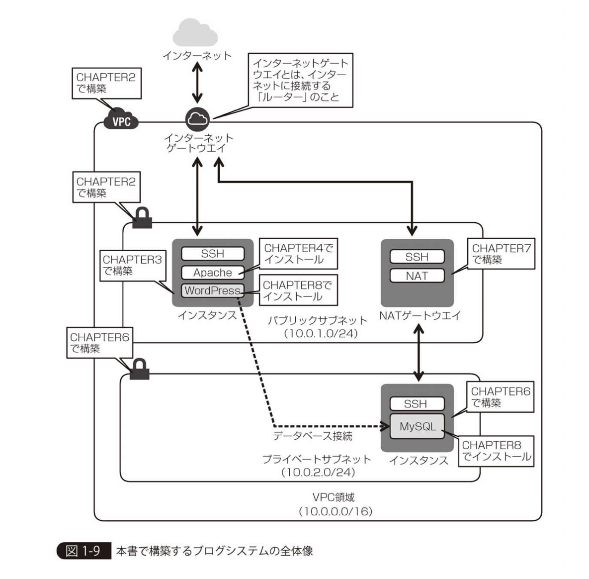

### README　兼学習メモ

##### 書籍「さわって学ぶクラウドインフラ Amazon Web Service 基礎からのネットワーク＆サーバー構築」（2017改訂版）に沿って進める

###### Chapter1〜9、及びAppendix A,Bの流れに従い、AWS EC2上にWordpressサーバを構築し、ブログを開設する。

上記の一連の作業を通し、（**一旦Docker他を排した最小構成で**）以下についての理解を深める。
- ネットワーク構築
- サーバー構築
- HTTP/HTTPS
- リクエスト/レスポンス
- TCP/IP (/UDP)
- ファイアウォール
- サブネットマスク
- 名前解決
- NATゲートウェイ

---

### 目次

1. システム構築をインフラから始めるには
2. ネットワークを構築する
3. サーバーを構築する
4. Webサーバーソフトをインストールする
5. HTTPの動きを確認する
6. プライベートサブネットを構築する
7. NATを構築する
8. DBを用いたブログシステムの構築
9. TCP/IPによる通信の仕組みを理解する
10. Appendix-A パケットキャプチャで通信を覗いてみる
11. Appendix-B ネットワークの管理・運用とトラブルシューティング

##### ネットワーク関連コマンド
`ping`, `traceroute`, `telnet`, `nslookup`, `dig`

##### ネットワーク関連ツール
- ネットワークプロトコルアナライザー
  - ネットワークを流れる生のデータを覗き見る
  - `Wireshark`等
- Webブラウザ付属のデベロッパーツール
  - Webサイトの表示に利用されるHTTPプロトコルに限ったデバッグ用途

---

- 書籍に従い、WebサーバとしてはNginxではなくApacheを使用する。
- DBはMySQL(5.7)
- OSは基本的に標準的なEC2用の無料利用枠AMIのLinuxバージョンを利用

---

CHAPTER1-3(図1-5)に従い、以下を実装しながら学んでいく。
- Wordpressによるブログシステム作成
- サーバーの構築
- ネットワークの構築
- 問題を解決するツール

10/13

### (方針変更）AWS & Docker & Laravelを最初から組み合わせて公開用ポートフォリオ作成するのは一旦停止

→　一旦AWSはAWS、DockerはDocker、LaravelはLaravel(ただしLaradockは利用)に分割して学習し直す
- それぞれの教材は既に購入済み
  - AWSでWordpressブログシステム構築→Kindle本
  - Docker、Dockerfile、 docker-compose.yml、docker-machine→Udemy動画
  - Laravel(Laradock)でアプリ開発→リアル書籍及び電子書籍ほか
- 最終的にそれら全てを統合＆かつAWSの各リソースを`Terraform`を使って管理し、かつ`CircleCI`を組み込んでビルド、テスト、デプロイの自動化までを一式揃えた環境を実現する為の教材としてBOOTHで買ったPDF教材に進む。

- まずはそれぞれに対する理解を深める為に一旦3つのリポジトリに分解して学習を進める（ただし並行して進める）
  - Laravelアプリは一旦Laravelだけ（ただしLaradockは使用）で公開用アプリケーション作成に集中する
  - DockerはDocker学習（特にDockerfile及びdocker-compose.yml）への理解を深める目的だけに絞り別のリポジトリ作成
  - AWSは「さわって学ぶクラウドインフラ Amazon Web Service基礎からのネットワーク＆サーバー構築　改訂版」に従い進める
    - AWS VPCに領域を確保し、IPアドレス範囲を決めてパブリックサブネットとプライベートサブネットに分ける。
    - パブリックサブネット上のEC2インスタンス上にWebサーバを立てる
      - (今回は実験なので、理解しやすいよう分けずに全て東京リージョンの同アベイラビリティに統一する）
      - サーバに対してファイアウォールも設定する。
      - DNSを設定して、ドメイン名でもアクセスできるようにする。
      - デバッグツールを用いて、実際にHTTP通信でどのようなデータが送受信されているかを覗き見る。
      - 教科書に従い、WebサーバとしてはNginxではなくApacheをインストール
    - インターネットからは見えないプライベートサブネットを作り、DBサーバーを配置する。
    - DBサーバーとしてはMySQL(5.7)を利用
    - DBサーバ側からは一方的にインターネットに接続できるように、NATゲートウェイを構築する
    - DBサーバー構築後に、ApacheサーバーにWordpressをインストールし、ブログシステムを完成させる。
    - プライベートサブネット内のDBサーバ側からは一方的にインターネットに接続できるよう（逆は不可）に、NATゲートウェイをパブリックサブネットに設定する
      - 最後に、TCP/IPによる通信の仕組みを理解する




---

# CHAPTER2. ネットワークを構築する（AWS VPC)

### 2-1 ネットワークで用いるIPアドレス範囲を定める

- パブリックIPアドレス(グローバルIPアドレスとも言うが、AWSではパブリックIPアドレスで統一)
- プライベートIPアドレス

TCP/IPプロトコルにおける通信先を特定する為にネットワーク上で重複しない唯一無二のIPアドレス
**ここではIPv4のみを取り扱うこととし、IPv6については触れないものとする**

```
192.168.0.1/32
```

本来は2進数の8桁（ビット）×4＝32ビット
8ビットづつピリオド(.)区切りで4つに分割し、10進数(0~255)に変換したものがIPアドレス

##### インターネット上で使われない（自由に利用してよいプライベートIPアドレス範囲

|**プライベートIPアドレス範囲**|
|---|
|10.0.0.0 ~ 10.255.255.255|
|172.16.0.0 ~ 172.31.255.255|
|192.168.0.0 ~ 192.168.255.255|

そのネットワーク内で使うIPアドレスの個数を指定(2のn乗個単位)
  - 一般的によく指定されるのは256個(192.168.1.0 ~ 192.168.1.255等)
    - ネットワーク部…24ビット、ホスト部…8ビット
  - または65536個(192.168.0.0 ~ 192.168.255.255等)
    - ネットワーク部…16ビット、ホスト部…16ビット

  IPアドレスは、前半の部分を「ネットワーク部」、後半の部分を「ホスト部」と呼ぶ。
  - ネットワーク部は同じネットワークに属する限り同じ値
  - ホスト部が割り当てたいサーバーやクライアント、ネットワーク機器に一意な連番（飛び飛びの値で可）となる。
    - `ホスト（host）`とはコンピュータ（サーバーマシン）やルーターなどのネットワーク機器など、一意なIPアドレスを持つ通信機器の総称。

管理しやすくする為、用途別に少し離れたIPアドレスを割り当てる運用はよく行われる。
- ネットワーク機器　192.168.1.1, 192.168.1.2 ...
- サーバーマシン　　192.168.1.10, 192.168.1.11 ...
- クライアント　　　192.168.1.100, 192.168.1.101 ...

#### CIDR表記とサブネットマスク表記

`192.168.1.0 ~ 192.168.1.255`といった表現は長い為、通常IPアドレス範囲を示す時には以下のいずれかが用いられる。

- 「CIDR表記（サイダー：Classless Inter Domain Routing）」
  - IPアドレスを2進数で表した時、ネットワーク部のビット長を`/ビット長`で示す方法。
  - このビット長のことを「プレフィックス(prefix)と言う
  - `192.168.1.0 ~ 192.168.1.255`の場合、プレフィックスは24ビット　→　`192.168.1.0/24`
  - `192.168.0.0 ~ 192.168.255.255`の場合　→　`192.168.0.0/16`と記述する。
- サブネットマスク表記
  - プレフィックスのビット数分だけ2進数の「1」を並べ、残り（＝ホスト部）は「0」を記述した表記
  - `192.168.1.0 ~ 192.168.1.255`の場合、サブネットマスクは`255.255.255.0`なので`192.168.1.0/255.255.255.0`と表記する。


※AmazonVPCの仕様では、VPC領域を作成するときに、プレフィックス長として「16以上」を指定する必要がある
上記のため、本書に従ったネットワークの構築においては、
`10.0.0.0/16`というCIDRブロック（IPアドレス範囲）を利用してプライベートIPアドレスのネットワーク空間を作成することにする。
→実際のIPアドレス範囲として表記すると「10.0.0.0/16」→「10.0.0.0 ~ 10.0.255.255」

---

2019/10/13(Sun)19:35
- AWS VPC領域を作成
  - **※これまでAWSで使ってきた既存のVPCとは別に、全く新しく領域を作成した。**
- VPCをサブネットに分割（パブリックサブネット及びプライベートサブネットの2つ）

2019/10/15
- AWS INNOVATE視聴

